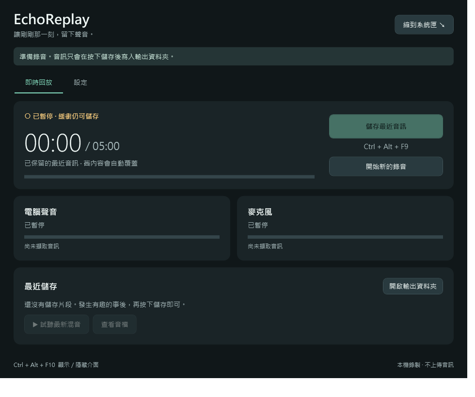

# EchoReplay · 聲音回放

**為遊戲與語音聊天保留剛剛發生的聲音。**

EchoReplay 是 Windows 的純音訊即時回放工具。背景持續保留最近幾分鐘的電腦聲音與麥克風，在有趣的事情發生後，按一下快捷鍵就能存成 WAV，省去從遊戲影片擷取音訊的步驟。

目前版本：**1.0.1**。已完成核心自動化測試及電腦聲音的短時間實機測試；完整驗證範圍與限制見 [驗證紀錄](VALIDATION.md)。

## 直接下載使用

**[下載 Windows 安裝版](https://github.com/cacich/EchoReplay/releases/latest/download/EchoReplay-Setup-x64.exe)** · [下載免安裝 ZIP](https://github.com/cacich/EchoReplay/releases/latest/download/EchoReplay-portable-win-x64.zip) · [查看最新 Release](https://github.com/cacich/EchoReplay/releases/latest)

下載安裝版後雙擊，依畫面完成安裝，再從開始功能表開啟 **EchoReplay**。不需要下載原始碼或另外安裝 .NET。適用於 Windows x64，最低 Windows 10 1809；Windows 10／11 的不同硬體情境仍需實際驗證。

安裝在目前使用者的資料夾，不需要管理員權限。免安裝版請先解壓縮整個 ZIP，再執行 `EchoReplay.exe`。GitHub Release 中的 **Source code** 是原始碼，一般使用者不用下載。

目前程式尚未簽章，Windows 可能顯示不明發行者或 SmartScreen 提示；請確認下載來源是本專案的 GitHub Release。



## 功能

| 功能 | 說明 |
| --- | --- |
| 循環錄音 | 保留最近 1／3／5／10 分鐘，預設 5 分鐘 |
| 雙來源錄製 | 一個電腦播放裝置＋一個麥克風，可關閉麥克風 |
| 混音與分軌 | 48 kHz / 16-bit WAV，混音為立體聲，麥克風分軌為單聲道 |
| 背景執行 | 關閉或最小化視窗後繼續錄音，從系統匣管理 |
| 全域快捷鍵 | 儲存音訊、顯示／隱藏介面，支援自訂及占用檢查 |
| 開機啟動 | 可選擇登入 Windows 後在系統匣自動啟動 |
| 輸出設定 | 自訂資料夾、混音音量、分軌與錄音來源 |
| 狀態監看 | 音量條、來源連線狀態、儲存提示與裝置重連 |

音訊擷取與存檔在本機完成，程式沒有音訊上傳功能。

## 從原始碼建置（開發者）

此 Git 儲存庫提供原始碼、圖示、文件、建置腳本與測試；**編譯後的 EXE／ZIP 不放在 Git 歷史中**。

需要 Windows x64、PowerShell、Git，以及 **.NET 10 SDK**。SDK 請由 [Microsoft 官方網站](https://dotnet.microsoft.com/download/dotnet/10.0) 安裝。首次建置需要連線到 NuGet 下載相依套件。

```powershell
git clone https://github.com/cacich/EchoReplay.git
cd EchoReplay
.\build.ps1 -Portable
.\artifacts\EchoReplay-portable\EchoReplay.exe
```

建置腳本會先執行測試，再產生包含 .NET 執行環境的 Windows x64 可攜版。將 `artifacts/EchoReplay-portable` 整個資料夾複製到另一台 Windows x64 電腦即可使用，不必另裝 .NET。

若已取得可攜版資料夾，直接執行其中的 `EchoReplay.exe`。預設會開始錄音；一般情況不需要系統管理員權限。其他建置方式與打包步驟見 [製作說明](docs/DEVELOPMENT.md)。

## 快速使用

1. 開啟程式，在「設定」選擇 Discord／遊戲實際使用的播放裝置與麥克風。
2. 播放聲音並說話，確認音量條有反應。
3. 發生有趣的事後按 **Ctrl + Alt + F9**，儲存當下之前的音訊。
4. 按 **Ctrl + Alt + F10** 顯示／隱藏介面。
5. 在系統匣右鍵選單選「結束 EchoReplay」，才能完全結束程式。

預設保存到使用者「音樂」資料夾的 `EchoReplay` 子資料夾。每次儲存建立獨立資料夾，包含 `混音.wav`，以及啟用分軌時的 `電腦聲音.wav`、`麥克風.wav`。

快捷鍵、輸出資料夾、開機啟動等選項修改後，按「套用設定」生效。**開機自動執行預設關閉。**

## 使用前要知道

- 程式必須已經在錄音，才能儲存過去的聲音；未儲存的緩衝會在結束程式或重新開始錄音時消失。
- 目前只擷取一個播放裝置。Discord 與遊戲若使用不同輸出裝置，請先改成相同裝置。
- 麥克風直接從 Windows 擷取，**Discord 的靜音、按鍵發話與降噪設定不會套用到這份錄音**。
- 裝置斷線會重試，但無法補回斷線或電腦睡眠期間的聲音。
- 第一版尚未包含內建裁切、MP3 匯出，以及 Discord／遊戲各自分軌。
- 目前開發環境未能實測麥克風；麥克風收音、雙來源實機同步及長時間運作仍需更多驗證。

詳細設定、容量估算及移除方式見 [使用指南](docs/USER_GUIDE.md)，常見問題見 [疑難排解](docs/TROUBLESHOOTING.md)。

## 專案文件

| 文件 | 內容 |
| --- | --- |
| [使用指南](docs/USER_GUIDE.md) | 錄音、快捷鍵、背景執行、輸出檔案與設定 |
| [製作說明](docs/DEVELOPMENT.md) | 專案背景、開發環境、建置、測試與打包 |
| [Release 發佈說明](docs/RELEASING.md) | 安裝程式、自動發佈與版本更新 |
| [架構說明](docs/ARCHITECTURE.md) | 音訊流程、循環緩衝、同步與模組責任 |
| [疑難排解](docs/TROUBLESHOOTING.md) | 無聲、裝置中斷、快捷鍵及啟動問題 |
| [驗證紀錄](VALIDATION.md) | 已完成的測試、實機結果及未驗證項目 |
| [變更紀錄](CHANGELOG.md) | 版本功能摘要 |
| [貢獻說明](CONTRIBUTING.md) | 修改專案與回報問題的方式 |
| [第三方元件聲明](THIRD-PARTY-NOTICES.txt) | NAudio 與打包執行環境的授權資訊 |

## 技術與目錄

C# / WPF / .NET 10，使用 NAudio.Wasapi 2.2.1 呼叫 Windows WASAPI。

```text
EchoReplay/
├─ src/EchoReplay/             # WPF 程式與錄音核心
├─ tests/EchoReplay.Tests/     # 自動化測試執行程式
├─ docs/                      # 使用、開發、架構與排錯文件
├─ build.ps1                  # 測試、發佈與文件打包
├─ build-release.ps1          # 安裝 EXE、免安裝 ZIP 與校驗值
├─ installer/                 # Inno Setup 安裝設定
├─ scripts/                   # 安裝驗收腳本
├─ .github/workflows/         # 版本標籤觸發的發佈流程
├─ README.md
├─ VALIDATION.md
├─ CHANGELOG.md
└─ THIRD-PARTY-NOTICES.txt
```

`.tools/`、`artifacts/`、`bin/`、`obj/` 與使用者音檔皆由 `.gitignore` 排除。
