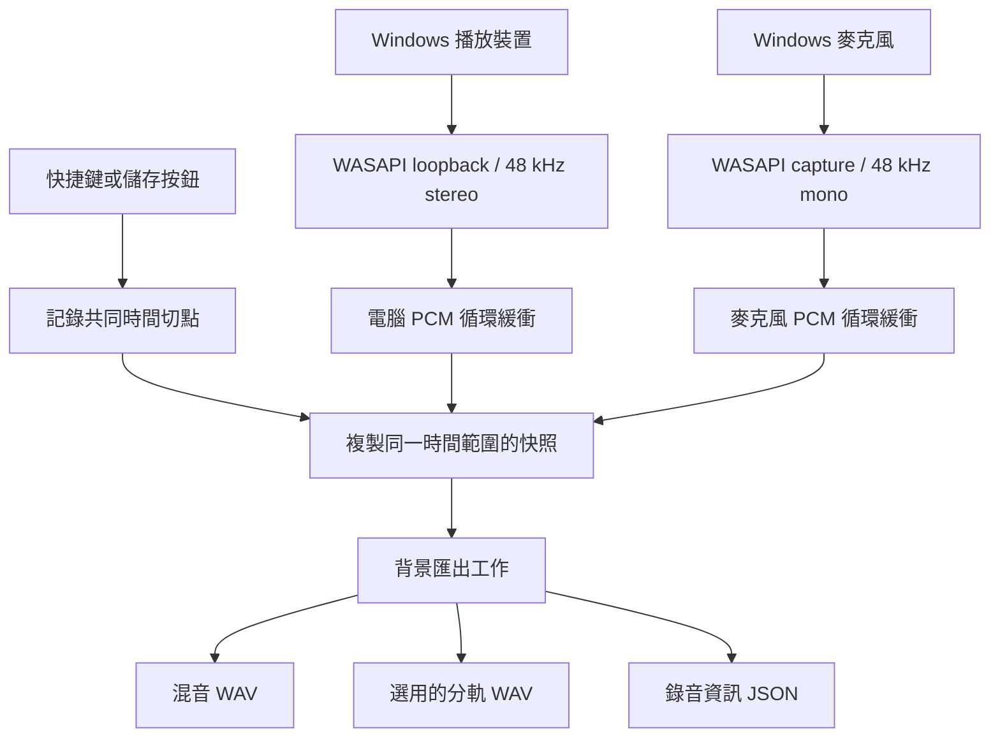

# 架構說明

## 1.1 剪輯模組

- `ClipLibrary` 掃描輸出根目錄的錄音群組及 `Exports` 成品；匯入會建立 WAV 副本。刪除前驗證直接父目錄、已知檔名及重新解析點，透過 Windows Shell 移至資源回收筒，不使用永久刪除的備援路徑。
- `EditAudio` 載入最多 15 分鐘的單／雙聲道來源，正規化為 48 kHz PCM。錄音有分軌時使用原始分軌；只有混音時使用單一來源。
- `EditHistory` 使用整數 frame 記錄來源區間與靜音標記；裁切與刪除在目前時間軸計算，再映射回原始來源。兩軌共用相同區間，因此不會因剪輯失去同步。
- `EditPcmStream` 串流產生雙聲道 PCM，套用分軌增益、限幅及整段淡入淡出。播放與匯出共用同一實作，避免兩者結果不同。單一音檔的 100% 音量不會再次限幅。
- `WaveformView` 繪製每 5 ms 的峰值摘要，支援拖曳選取、縮放與平移；不為每個取樣建立 WPF 元素。
- `EditFiles` 將進度存為帶版本的 JSON，以來源檔名、長度、修改時間檢查來源是否變更；先寫暫存檔再替換。成品同樣在成功編碼後才取代目的檔案，取消不損壞舊檔。
- `EditorPanel` 負責音檔庫、編輯、播放與工作狀態。讀取、峰值計算及匯出在背景執行；WASAPI 錄音執行緒與緩衝不依賴剪輯模組。

MP3 編碼／解碼使用現有 NAudio.Wasapi 所封裝的 Windows Media Foundation，不隨程式分發 FFmpeg 或額外編碼器。WAV 使用 NAudio 的 PCM 讀寫。Windows N／移除媒體元件的系統需補裝媒體功能才能使用 MP3。

進度只記錄目前結果，不保存跨程式重啟的 undo stack。剪輯預覽仍屬於系統播放聲音，會被 loopback 收錄；排除自身播放屬於後續錄音來源分離工作。

[回到專案首頁](../README.md)

## 資料流

## 模組責任

原始碼位於 `src/EchoReplay`。

| 模組 | 責任 |
| --- | --- |
| `App` | 設定、啟動參數、以 Mutex／Event 維持單一執行個體 |
| `MainWindow` | WPF 畫面、系統匣、設定表單、音量顯示及操作協調 |
| `ReplayEngine` | 錄音生命週期、共用時鐘、緩衝、儲存互斥及快照 |
| `CaptureSource` | 背景 WASAPI 擷取、封包時間戳、峰值及重新連線 |
| `AudioDevices` | 列出可用播放／輸入裝置 |
| `TimelineBuffer` | 固定大小 PCM 緩衝、絕對時間分頁及快照 |
| `WaveExporter` | WAV 寫入、麥克風單聲道映射與混音限幅 |
| `HotkeyManager` | `RegisterHotKey`、`WM_HOTKEY`、占用檢查與恢復 |
| `SettingsStore` / `LoginStartup` | JSON 設定及目前使用者的登入啟動項目 |

## 擷取與同步

每個來源有一條 MTA 背景執行緒，以 WASAPI shared mode 連接裝置。電腦聲音使用 loopback；麥克風使用 capture。Windows 依請求格式轉為 48 kHz float，再由程式轉為 16-bit PCM 存入緩衝。

`ReplayEngine` 啟動時建立共同的 `Stopwatch` 起點。`CaptureSource` 使用 WASAPI 封包的 QPC 時間戳（100 ns 單位）計算資料在時間軸上的影格位置，而不是使用回呼抵達時間。

- 有效時間戳換算為絕對影格位置。
- 與前一封包末端相差不超過 48 個影格（1 ms）時，沿用連續位置以減少小幅抖動。
- 較大的間隙保留為空白，避免把斷線前後的音訊直接拼接。
- 時間戳被標示有誤時，優先以先前封包尾端推估；第一個封包才以目前時鐘減去封包長度估算。

這個設計讓兩個來源共用時間軸，但尚未完成雙硬體來源的同步精度測試。長時間時鐘漂移、驅動延遲與錯誤時間戳仍屬待驗證項目。

## 循環緩衝

每個 `TimelineBuffer` 包含 PCM 樣本陣列與絕對分頁編號陣列。每頁 480 個影格，相當於 10 ms。

寫入時以「絕對頁數對頁數容量取餘數」定位實體頁。實體頁換成較新的絕對頁時先清空舊資料；讀取時只有頁編號符合才複製，否則保持靜音。較舊、延遲抵達的封包不能覆蓋已更新的頁面。

因此環狀陣列繞回後，靜音或斷線區段不會讀到幾分鐘以前的殘留聲音。緩衝容量為設定的分鐘數加 2 秒，提供匯出取快照的餘裕。

來源寫入與單份緩衝快照使用鎖保護；快照是獨立陣列，後續錄音不會改動已複製的樣本。

## 儲存流程

1. 使用 `Interlocked` 防止重複儲存工作同時執行。
2. 在按鍵當下記錄結束影格，計算最多保留指定分鐘數的共同範圍。
3. 等待 150 ms，讓涵蓋按鍵時刻的擷取封包有機會抵達。
4. 在背景工作中複製兩個來源的相同時間範圍。
5. 建立唯一的 `.Replay_….partial` 目錄，寫入混音、選用分軌及資訊 JSON。
6. 所有檔案完成後，把暫存目錄改名為正式片段目錄。

寫檔失敗會回報錯誤，正在錄製的緩衝繼續運作。寫入過程發生錯誤時，程式嘗試清除該次匯出的暫存目錄；若被強制終止，仍可能留下 `.partial` 目錄。

混音將麥克風單聲道值送到左右兩聲道，再分別套用增益。振幅超過 0.8 的區段使用 `tanh` 柔性限幅；分軌輸出不套用混音增益。

## 生命週期與背景執行

| 操作 | 行為 |
| --- | --- |
| 開始 | 建立新緩衝與共同時鐘，啟動擷取執行緒 |
| 暫停 | 停止擷取並固定結束影格，保留緩衝供匯出 |
| 重新開始 | 建立新緩衝，取代未儲存的舊內容 |
| 關閉／最小化視窗 | 隱藏 WPF 視窗，保留系統匣與錄音 |
| 系統匣結束 | 停止計時器、解除快捷鍵、停止擷取並結束；存檔中會等待使用者在完成後再次結束 |

WPF 使用 `OnExplicitShutdown`，隱藏視窗不會結束程式。快捷鍵仍由現存視窗 Handle 接收。編輯快捷鍵欄位時暫停全域註冊，離開欄位後恢復，避免編輯動作誤觸功能。

## 裝置重連

指定裝置無法使用或擷取失敗時，來源標示中斷，等候 2 秒後重試。選擇「跟隨 Windows 預設」時，約每 2 秒檢查預設多媒體裝置是否改變；切換後重新初始化擷取。

重連保留共同時鐘與原有緩衝，所以缺口以時間上的靜音區段呈現，無法還原中斷期間未擷取的聲音。

## 設定與啟動

- 設定路徑：`%LOCALAPPDATA%\EchoReplay\settings.json`。
- 先寫 `.tmp` 再替換正式檔案，降低只寫入半份設定的機會。
- 無法解析時使用預設值並提示；分鐘數、增益與快捷鍵會做基本校正。
- 變更來源、麥克風開關或保留時間後套用，錄音中會重新開始。輸出位置及快捷鍵等一般設定不清空緩衝。
- 開機啟動項目為 `HKCU\Software\Microsoft\Windows\CurrentVersion\Run\EchoReplay`，指向目前 EXE 並加上 `--background`。
- 單一實例使用設定目錄的 SHA-256 摘要命名本機 Mutex／Event。`--data-dir` 隔離設定與執行個體，但不隔離全域快捷鍵或登入啟動登錄項目。

## 容量估算

雙來源總共 3 聲道，每秒約 `48,000 × 2 bytes × 3 = 288,000 bytes`。

| 保留時間 | 雙來源緩衝約值 | 混音＋兩份分軌檔案約值 |
| --- | --- | --- |
| 5 分鐘 | 87 MB（含額外 2 秒） | 144 MB |
| 10 分鐘 | 173 MB（含額外 2 秒） | 288 MB |

使用十進位 MB，不含 WPF、.NET、音訊 client 等額外記憶體。存檔快照會暫時增加大致等同音訊緩衝的記憶體。以上是設計估算，不是整體程序的效能量測。
